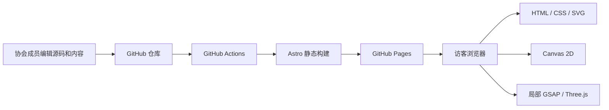
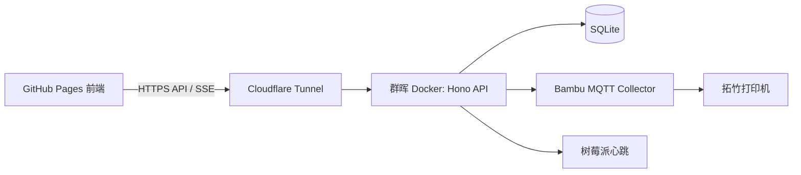
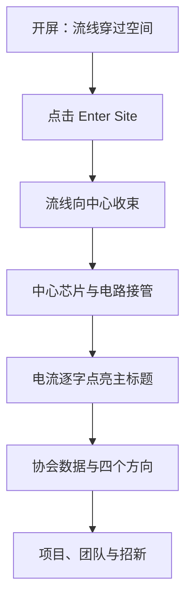
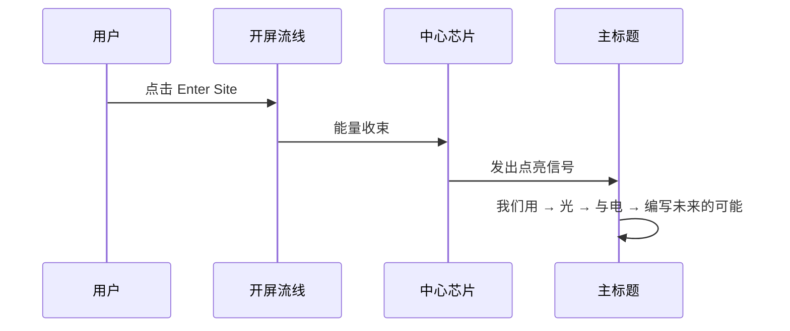

# 光电科技协会网站架构与视觉演进路线图

> 本文是后续实现与验收的主路线图。每次只推进一个阶段，浏览器验收通过后再进入下一阶段。
>
> 基线日期：2026-09-04  
> 线上地址：<https://konefly.github.io/pec-website/>  
> 当前线上提交：`74fe715`

## 1. 项目定位

网站首先承担协会宣传展示：介绍协会、呈现竞赛方向与成果、展示团队与招新信息。视觉语言需要体现嵌入式、计算机视觉、机器人和创客实践的工程气质，同时保持内容清晰、移动端可用和 GitHub Pages 可部署。

飞书资料和 NAS 文件不在公开网站中暴露。设备状态、物品留言属于可选扩展，只有明确需要时才启用群晖后端。

## 2. 当前架构

### 2.1 已投入使用

| 层级 | 实现 | 状态 |
|---|---|---|
| 源码 | GitHub `KoneFly/pec-website` | 已使用 |
| 构建 | Astro 静态输出 | 已使用 |
| 托管 | GitHub Pages | 已上线 |
| 开屏 | 72 条 SVG 贝塞尔流线、逐字标题、手动 Enter Site | 已使用 |
| 首页背景 | 固定视口的 SVG 电路、中心芯片丝印、沿线光点 | 已使用 |
| 环境纹理 | 低密度 Canvas 2D 星尘 | 已使用 |
| 页面动画 | CSS 过渡、IntersectionObserver、数字滚动 | 已使用 |

### 2.2 本地待验收

启动页和主页已加入连续交接：点击 Enter Site 后，开屏流线向中心收束，主页电路由同一中心淡入，正文稍后出现。该改动当前尚未提交和部署。

### 2.3 当前不启用

| 能力 | 当前决定 |
|---|---|
| 飞书 API / OAuth | 不接入公开站；成员直接在飞书访问内部资料 |
| NAS 文件浏览 | 不接入公开站；通过飞书内部文档提供访问说明 |
| 打印机实时状态 | 保留为后续选项，宣传站当前不依赖 |
| 贵重物品留言 | 保留为后续选项，宣传站当前不依赖 |
| 自定义域名 | 暂不购买，继续使用 GitHub Pages 地址 |

## 3. 可选动态架构

只有启用打印机状态或物品留言时，才增加以下链路：

- 宣传内容继续静态托管，后端中断时首页仍可访问。
- 群晖只提供设备状态和留言 API，不向公网暴露 DSM、SMB 或 File Station。
- 打印机只显示离线、空闲、使用中，不公开任务文件、摄像头和用户信息。
- Cloudflare Tunnel 只代理 API 容器。

## 4. 视觉叙事

### 4.1 已完成模块

| 模块 | 当前实现 | 后续调整 |
|---|---|---|
| `IntroScreen` | 72 条流线、标题、手动进入 | 微调节奏和移动端密度 |
| 开屏交接 | 流线收束、中心闪光、电路淡入 | 本地待验收 |
| `CircuitFlow` | SVG 直角线路、丝印芯片、移动光点 | 建立文字安全区与状态接口 |
| 星尘 | Canvas 2D 小粒子 | 内容区逐步减弱 |
| 页面入场 | fade-up、数字滚动 | 统一时间和 easing |

### 4.2 主标题“通电点亮”方案

主标题“我们用光与电，编写未来的可能”由电路背景触发，不再作为独立的普通淡入动画。

实现约束：

- 将标题拆成语义片段，而不是逐个字符随机闪烁。
- “光”使用冷白高亮，“电”使用品牌蓝脉冲，其他文字由暗到亮。
- 点亮顺序与背景光点抵达芯片的时间一致。
- 动画结束后文字保持稳定，不持续闪烁。
- `prefers-reduced-motion` 下直接显示最终状态。
- 动画只由一个时间轴控制，避免 CSS、SMIL 和 GSAP 各自计时。

建议时间轴：

| 时间 | 状态 |
|---:|---|
| 0ms | 点击进入，开屏流线收束 |
| 360ms | 电路背景开始显现 |
| 700ms | 芯片核心短脉冲 |
| 820ms | “我们用”点亮 |
| 980ms | “光”点亮并产生冷白余辉 |
| 1160ms | “与电”点亮，蓝色脉冲沿字缘通过 |
| 1380ms | “编写未来的可能”整体显现 |
| 1900ms | 所有文字进入稳定状态 |

### 4.3 缓解深蓝疲劳

深蓝继续承担开屏、Hero 和电路空间，不再覆盖所有内容区。页面向下滚动后，以冷灰、近黑、黑白颗粒和真实照片形成节奏变化。

建议色彩节奏：

| 区域 | 背景 | 作用 |
|---|---|---|
| 开屏与 Hero | 深蓝黑 | 建立沉浸感 |
| 协会数据 | 近黑 + 冷白数字 | 从视觉体验转入事实信息 |
| 实践方向 | 冷灰或低饱和蓝灰 | 提高长文可读性 |
| 项目与照片 | 黑白照片 + 单一蓝色标记 | 让真实内容成为主体 |
| 招新 CTA | 回到深蓝 | 与开屏形成首尾呼应 |

### 4.4 黑白粒子与辉光管的分工

两种效果都可使用，但放在不同位置：

| 效果 | 使用位置 | 推荐实现 | 避免 |
|---|---|---|---|
| 黑白粒子 | 项目区过渡、照片遮罩、Logo 实验页 | 300–1500 个粒子，Canvas 2D 或 Three.js Points | 全站常驻、高密度噪声、遮住文字 |
| 辉光管 | `80+ / 175 / 182 / 2016` 数据区 | CSS/SVG 发光数字，冷白为主、少量琥珀色 | 把全部导航和正文做成复古仪表盘 |

辉光管作为少量暖色焦点，可以打破深蓝单调；使用范围只限统计数字。其余 UI 继续使用冷白与品牌蓝，保持协会的现代工程气质。

### 4.5 Rainform 与 Ark-Particle-Imitate 的参考边界

Rainform 提供“一个状态驱动整个场景”的架构参考：统一状态控制粒子、光点、芯片和声音。实现时重新设计，不直接复制其受 PolyForm Noncommercial 约束的源码。

Ark-Particle-Imitate 可借鉴图片采样、聚合/散开和鼠标扰动。原实现会在 Canvas 2D 中逐帧遍历全部粒子，集成时限制数量，并在离开视口时暂停。

| 项目 | 桌面 | 移动端 |
|---|---:|---:|
| Logo 粒子数 | 800–1500 | 300–500 |
| 同时运行的 rAF | 最多 2 | 最多 1 |
| 离开视口 | 暂停 | 暂停 |

## 5. UI 设计系统

### 5.1 视觉语言

- 主色来自协会 Logo 的蓝色体系，使用冷白、灰蓝、近黑和少量暖色辉光构成层级。
- 工程信息使用网格、坐标、编号、线路和丝印。
- 图片优先使用真实协会活动、设备、PCB、打印件和比赛现场照片。
- 明日方舟式设计借鉴信息分层、动线、留白、编号和纹理处理。
- 每屏只有一个主要视觉焦点，背景为正文保留低对比安全区。

### 5.2 字体候选

| 用途 | 当前 | 候选 | 备注 |
|---|---|---|---|
| 中文标题 | Noto Serif SC | 思源宋体 | 学术、稳重 |
| 中文正文 | Noto Sans SC | MiSans / HarmonyOS Sans | 使用前核验字体许可 |
| 英文标题 | Cormorant Garamond | Clash Display / Satoshi | 先在隔离页验证 |
| 数据和标签 | JetBrains Mono | 保留 | 可读性稳定 |
| 辉光数字 | JetBrains Mono 或专用七段字形 | 单独组件 | 不影响正文字体 |

### 5.3 图标规范

- 使用同一套线性图标，统一 1.5px 或 2px 描边。
- 图标只用于导航、状态和操作。
- 优先采用许可明确的 SVG；ignoredone 自制图标包需记录下载页和许可。
- 协会专属图标包括嵌入式、视觉、机器人、创客、竞赛、团队、设备和加入协会。

## 6. 分阶段实现

每个阶段结束后保存桌面和移动端截图、运行生产构建，并由用户验收。

### 阶段 0：路线图与资源台账

状态：已完成。

交付本文档、`asset-catalog.md`、README 文档入口和品牌规范同步说明。

### 阶段 1：开屏与主页交接

状态：已完成本地验收，尚未推送线上。

验收：未点击时不进入主页；点击后流线收束、电路接管、正文后出现；桌面和移动端无闪白及横向滚动。

### 阶段 2：主标题通电点亮

状态：已完成本地验收。

只修改主标题结构和一条统一时间轴。标题已拆成“我们用 / 光 / 与电 / 编写未来的可能”四段，点击开屏后按顺序点亮。

### 阶段 3：色彩节奏与统计辉光管原型

状态：已完成本地验收。

统计区已使用近黑背景、暖琥珀数字和低强度扫描线；桌面与移动端均无横向溢出。

### 阶段 4：公开页面骨架与基础组件

状态：已完成本地验收。

已建立 `SiteLayout`、`InfoRow`，并补齐团队、项目、招新、设备和资产五个公开路由。真实成员、项目和联系方式仍待协会补充。

### 阶段 4.1：字体与图标系统

状态：待做。

建立 CSS tokens、字体组合、8–12 个协会线性图标和 Button、SectionHeader、Metric、TechnicalLabel 等复用组件。

### 阶段 5：黑白粒子过渡原型

状态：已完成本地验收。

项目页资料区已加入轻量 Canvas 2D 黑白粒子，支持固定 seed、鼠标局部排斥、移动端降密度和离开视口暂停。

### 阶段 6：隔离的 Logo 粒子原型

状态：实验页和开屏接入均已完成本地验收。

新增 `/lab/logo-particles`，完成 Logo 抽象轮廓、芯片丝印和英文名三态；实验页桌面 1000 粒子、移动端 420 粒子，支持按钮切换、Replay、鼠标局部排斥和 reduced-motion 降级。开屏采用轻量模式，桌面 600 粒子、移动端 300 粒子，并自动经历三态后等待用户点击进入。

### 阶段 7：主页电路背景优化

调整线路密度、芯片比例、正文安全区和滚动透明度；为未来设备数据预留单一状态接口。

### 阶段 8：首页内容区与真实素材

完成成果、实践方向、团队和招新内容。使用全宽图片、编号列表、时间线和技术标签建立不同页面节奏。

### 阶段 9：组件拆分

将过大的 `index.astro` 按职责拆分；清理旧 `variants` 页面或迁移至开发目录。

### 阶段 10：可选设备状态层

先用模拟数据完成组件，再决定是否启动群晖 API、MQTT 和 Tunnel。

### 阶段 11：上线质量门槛

- Astro 生产构建通过。
- GitHub Pages 子路径资源无 404。
- Chrome、Edge 和 390px 移动端通过。
- 无框架错误覆盖层和关键控制台错误。
- reduced-motion 下可完成全部操作。
- Lighthouse 性能、可访问性和 SEO 形成基线。

## 7. 技术选型

继续使用 Astro。它适合静态宣传内容，并允许 SVG、Canvas、GSAP 和 Three.js 按组件加载。WordPress 会增加 PHP、数据库和安全维护；Hexo、VitePress、Docusaurus、Hugo更适合博客或文档，迁移不会提升当前视觉能力。

若以后建立技术知识库，可新增 VitePress 子站，主宣传站保留 Astro。

## 8. 维护规则

- 一次只实现一个阶段或一个可独立验收的组件。
- 视觉改动先本地验证，用户确认后再提交和部署。
- 每个外部资源先登记到 `asset-catalog.md`。
- 每个动画说明触发、结束、移动端和 reduced-motion 策略。
- 架构变化时同步更新本文状态。
